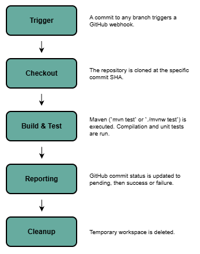

# DD2480-CI-V
## Summary
This project implements a minimal Continuous Integration (CI) server in Java, designed to demonstrate the core principles of continuous integration. The server listens for GitHub webhook events, checks out the affected branch, compiles the project, executes automated tests, and reports build results back to GitHub using commit status notifications.

**Core Idea:**
1. **GitHub webhook** notifies our server when someone pushes.
2. The server **checks out** the pushed branch/commit into a temporary workspace.
3. It **builds (compiles)** and **runs tests** in that workspace.
4. It **reports the result** (e.g., as a **GitHub commit status**).



---

## Table of Contents

- [DD2480-CI-V](#dd2480-ci-v)
  - [Summary](#summary)
  - [Table of Contents](#table-of-contents)
  - [Project Structure](#project-structure)
  - [Requirements and Dependencies](#requirements-and-dependencies)
    - [System Requirements](#system-requirements)
    - [Library Dependencies](#library-dependencies)
    - [Build \& Test](#build--test)
  - [Run the Server](#run-the-server)
  - [Local Setup with ngrok](#local-setup-with-ngrok)
  - [Grader's Guide](#graders-guide)
    - [How the CI Pipeline Works](#how-the-ci-pipeline-works)
    - [Testing the Webhook Locally](#testing-the-webhook-locally)
    - [Generating Javadoc](#generating-javadoc)
  - [Statement of Contributions](#statement-of-contributions)
    - [Individual Contribution:](#individual-contribution)
      - [Dev. Fabian W (GitHub: @crancker96):](#dev-fabian-w-github-crancker96)
      - [Dev. Apeel Subedi (GitHub: @rippyboii):](#dev-apeel-subedi-github-rippyboii)
      - [Dev. Carl Isaksson (GitHub: @carlisaksson):](#dev-carl-isaksson-github-carlisaksson)
      - [Dev. Josef Kahoun (GitHub: @kahoujo1):](#dev-josef-kahoun-github-kahoujo1)
      - [Dev. Alexander Runebou (GitHub: @a-runebou):](#dev-alexander-runebou-github-a-runebou)
  - [Team Achievements](#team-achievements)
  - [SEMAT](#semat)
  - [License](#license)

---

## Project Structure
```
.
├── .github/workflows/       # GitHub Actions 
├── ci-server/              # Main project file
│   ├── src/main/java/com/ci/
│   │   ├── Server.java     # HTTP server + webhook endpoint
│   │   ├── checkout/       # Git checkout logic
│   │   ├── pipeline/       # CIPipeline to structure the integration
│   │   └── statuses/       # GitHub commit status poster/reporting
│   └── src/test/java/...   # Unit tests
└── LICENSE
```

---


## Requirements and Dependencies

### System Requirements
- **Java 19+** (JDK) - tested on OpenJDK 19 and 21
- **Git** installed and available in PATH
- Internet access for webhooks and GitHub API

Verify your Java installation by running:
```bash
java -version
```

### Library Dependencies
The project uses the following key dependencies (managed via Maven):

| Library | Version | Purpose |
|---------|---------|--------|
| Jackson Databind | 2.17.2 | JSON parsing for webhook payloads |
| SQLite JDBC | 3.45.1.0 | Database for storing build results |
| JUnit Jupiter | 5.10.2 | Unit testing framework |
| JaCoCo | 0.8.11 | Code coverage reporting |

### Build & Test 
```bash
cd ci-server
./mvnw clean test
```
Note: This project uses Maven Wrapper, no local Maven installation is required. Tested with Maven 3.9.12.

---

## Run the Server

Start the server:

```bash
cd ci-server
./mvnw compile exec:java 
```

The server starts on **port 2485** by default and exposes:
- `POST /webhook`: GitHub sends push payloads here.
- `GET /builds`: Returns all saved build entries.
- `GET /builds/{SHA}`: Returns build info for a specific commit.

---

## Local Setup with ngrok
To test the CI server locally with GitHub webhooks, you can use [ngrok](https://ngrok.com/) to expose your local server to the internet.
1. Download and install ngrok from the [official website](https://ngrok.com/download).
2. Start your CI server locally by running:
   ```bash
   cd ci-server
   ./mvnw compile exec:java 
   ```
3. In a separate terminal, run ngrok to expose your local server (assuming your CI server runs on port `2485` as per default):
   ```bash
    ngrok http 2485
    ```
4. ngrok will provide you with a public URL (e.g., `https://<random-id>.ngrok-free.app`). Use this URL to configure your GitHub webhook.
5. In your GitHub repository, go to **Settings** > **Webhooks** > **Add webhook**.
   - Set the **Payload URL** to your ngrok URL (e.g., `https://<random-id>.ngrok-free.app/webhook`).
   - Set the **Content type** to `application/json`.
   - Disable **SSL verification**.
   - Choose **Just the push event** as the events you want to trigger the webhook.
   - Make sure the webhook is **Active**.
   - Click **Add webhook** to save.
6. Now, when you push changes to the GitHub repository, GitHub will send a webhook to your local CI server via ngrok, which triggers the pipeline.


## Notification of CI results
The notification of results was implemented using **commit statuses** via the GitHub REST API.

### Token Configuration
Settings for the notification must be stored in a `token.config` file. **This file must never be committed to the repository.**

1. Add your `token.config` file at following locations:
   - `ci-server/src/main/resources/token.config`
   - `ci-server/src/test/resources/token.config`


2. Edit the file with your credentials:
   ```
   owner: <GITHUB_USERNAME_OR_ORG>
   repo: <REPO_NAME>
   token: <GITHUB_PERSONAL_ACCESS_TOKEN>
   ```

> ⚠️ **Security Warning**: The `token.config` files are in `.gitignore` to prevent accidental commits. Never commit tokens to the repository.

### GitHub Token Setup
To post commit statuses, the server needs a GitHub personal access token with `repo:status` permission.
We recommend using fine-grained personal access tokens, [see GitHub Authentication](https://docs.github.com/en/authentication/keeping-your-account-and-data-secure/managing-your-personal-access-tokens).

### Testing Without Real GitHub Token
For unit tests, the `StatusPosterAdapter` class wraps the real `StatusPoster` and can be replaced with a mock `StatusReporter` interface for testing without making actual API calls. See `CIPipelineTest.java` for examples.

The notifications are sent using the `StatusPoster` class, which allows:
- Setting the commit status to one of: `'error'`, `'pending'`, `'failure'`, or `'success'`
- Adding a description for the status
- Adding a URL associated with the CI job

For more information, refer to the `StatusPoster` implementation.


---

## Build list URL
The CI server saves results of the individual builds inside a SQLite database. Specifically, the commit SHA, build/test result, short build/test description, and build date are saved for each commit received.

To view the saved entries, you can use the REST API by sending GET HTTP requests:
- `GET /builds` - returns information about all saved entries (JSON array)
- `GET /builds/{SHA}` - returns information about the entry with the given commit SHA

Example:
```bash
curl http://localhost:2485/builds
curl http://localhost:2485/builds/abc123
``` 


---

## Grader's Guide

All grading actions should be performed on the **`assessment`** branch.

### How the CI Pipeline Works
When a push event is received via webhook, the pipeline:
1. Extracts the `branch` and `commit SHA` from the JSON payload's `ref` and `after` fields
2. Clones the repository and checks out the specific commit
3. Detects the project directory (looks for `pom.xml` in root or `ci-server/` subdirectory)
4. Runs `./mvnw test` (or `mvn test` if no wrapper exists)
5. Reports success/failure as a GitHub commit status

### Testing the Webhook Locally
```bash
# Start the server
cd ci-server
./mvnw compile exec:java -Dexec.mainClass="com.ci.App"

# In another terminal, send a test webhook
curl -X POST "http://localhost:2485/webhook" \
  -H "Content-Type: application/json" \
  -d '{"ref":"refs/heads/assessment","after":"<COMMIT_SHA>","repository":{"clone_url":"https://github.com/a-runebou/DD2480-CI-V.git"}}'
```
Replace `<COMMIT_SHA>` with a valid commit that exists on GitHub.

### Generating Javadoc
```bash
cd ci-server
./mvnw javadoc:javadoc
# Output: target/site/apidocs/index.html
```  


## Statement of Contributions
 

### Individual Contribution:
#### Dev. Fabian W (GitHub: @crancker96): 
> Dummy Class, Documentation, Bug fixes


#### Dev. Apeel Subedi (GitHub: @rippyboii):
> CI Pipeline Implementation, Documentation, GitCheckout Service, Bug fixes


#### Dev. Carl Isaksson (GitHub: @carlisaksson):
> Compiler Integration, Bug fixes, Refactoring

#### Dev. Josef Kahoun (GitHub: @kahoujo1):
> Commit Status posting, Database handling, REST API for the database, Documentation

#### Dev. Alexander Runebou (GitHub: @a-runebou):
>  Project structure, HTTP server, Webhook handling, Documentation, Bug fixes, Code coverage


---

## Team Achievements
During the development of our CI server we focused on building a robust and testable architecture. Some aspects we are particularly proud of include:

> **Testing Strategy**: A combination of unit tests and integration tests was implemented to ensure the reliability of the CI pipeline. We achieved a code coverage of approximately 70%, which we consider a strong indicator of our testing efforts.

> **Modular Design**: Clear execution logic. Dependency injection allows flexible testing and easier maintenance. Status reporting decoupled from execution logic.

> **Automation and Quality Assurance**: Maven based build and test automation using GitHub Actions ensured that our code is continuously tested and built, maintaining high code quality throughout development.

> **Two-Stage Branch Protection (dev -> main):**  
We implemented a two-branch workflow with protection rules on both `dev` and `main`. Feature and fix branches are merged into `dev` via pull requests requiring at least two approvals and a passing CI check. The `main` branch is reserved for stable, reviewed changes. This setup keeps `main` consistently stable while allowing collaborative development on `dev`.

> **Conventional Commits & Consistent Naming:**  
We followed the Conventional Commits specification for commit messages throughout the project (e.g., `feat:`, `fix:`, `refactor:`, `test:`, `docs:`), making the change history easy to scan and review. In addition, we maintained consistent naming conventions across the codebase (classes, methods, variables, and packages) to keep the project readable and predictable for all team members.

## SEMAT 

**Team state (Essence "Team" alpha)**: Collaborating.

Our team is currently in the Collaborating state. The mission, roles, responsibilities, and communication methods are defined, and team members work together toward shared goals. 

For a detailed description, see our Wiki page at: [Team State - Progress of the team](https://github.com/a-runebou/DD2480-CI-V/wiki/Progress-of-the-Team).

---

## License

This project is licensed under the terms in [LICENSE](LICENSE).